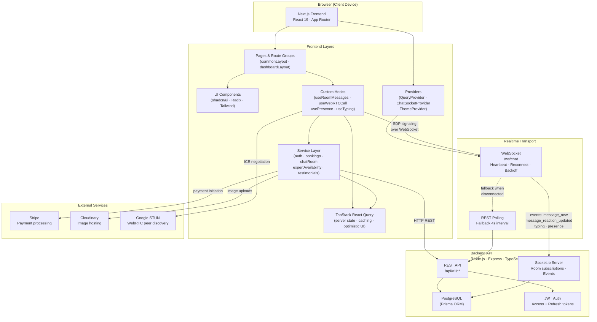
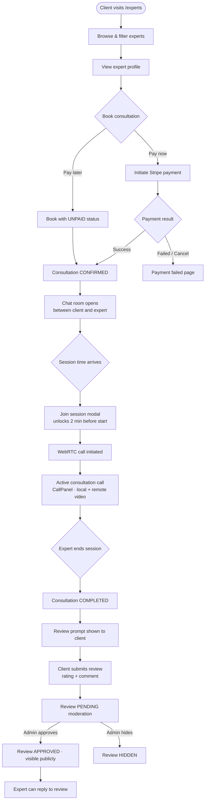
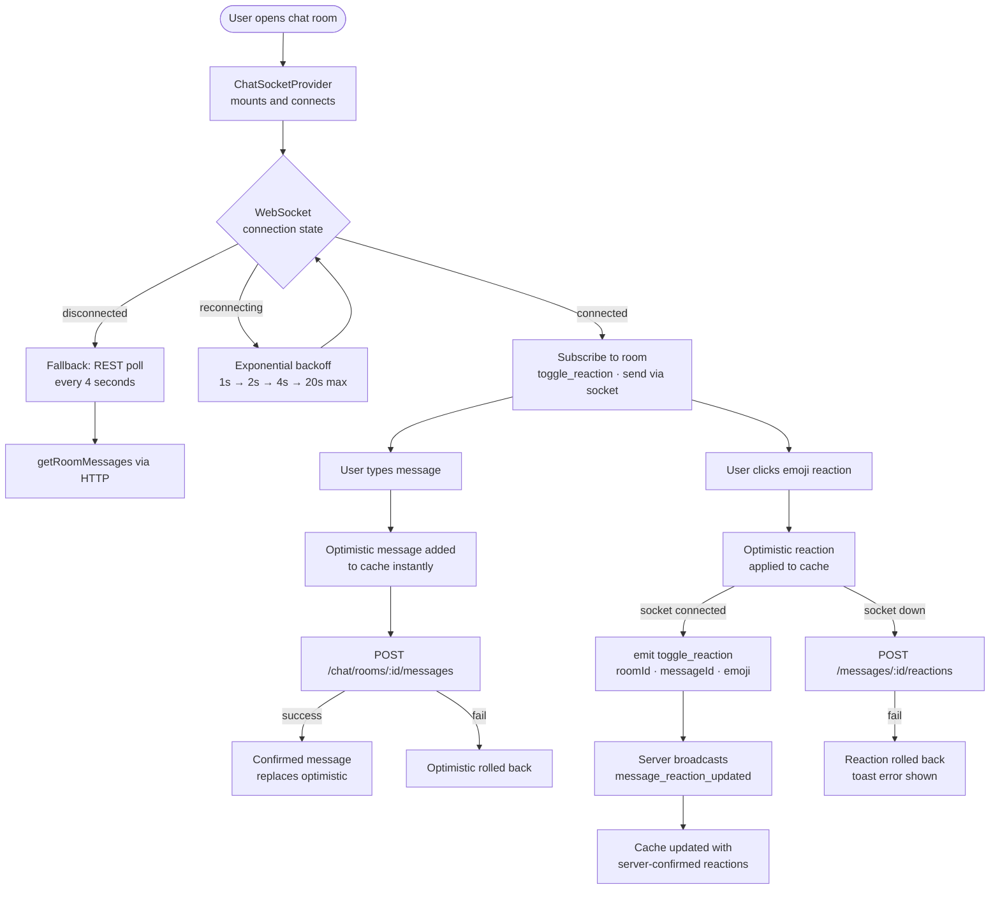
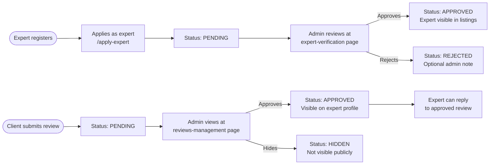

# ConsultEdge Frontend

ConsultEdge is a multi-role expert consultation marketplace built with Next.js. It helps clients find verified experts, book paid consultation sessions, collaborate through realtime chat and video calls, and complete the full consultation lifecycle inside one product.

This frontend supports three distinct product experiences:

- Client workspace for discovery, booking, payment, chat, calls, and reviews
- Expert workspace for profile growth, availability management, sessions, reviews, and operational workflows
- Admin workspace for moderation, verification, bookings oversight, industry management, and platform operations

## Problem This Project Solves

ConsultEdge addresses a common product gap in expert services: discovery, scheduling, payments, communication, and moderation often live in separate tools. That creates friction for clients, fragmented operations for experts, and weak visibility for admins.

ConsultEdge solves that by bringing the consultation journey into one platform:

- expert discovery with filtering and trust signals
- structured booking and rescheduling
- payment initiation and redirect handling
- realtime chat and attachments
- video consultation sessions
- reviews and moderation flows
- role-based dashboards for clients, experts, and admins

## Product Overview

The application is a Next.js App Router frontend for an expert consultation marketplace. Users can browse experts by industry, book sessions, communicate in chat rooms tied to consultations, join secure calls, and leave reviews after sessions. Experts manage availability and client sessions, while admins manage platform quality and business operations.

Primary product message from the app metadata:

> Connect with verified experts and get guidance that gives you a real advantage.

## Core User Journeys

### Clients

- Explore experts and industries
- View expert profiles and expertise
- Book consultations with pay-now or pay-later flows
- Open message rooms with experts
- Join consultation calls
- Track consultations by status
- Submit one review per consultation after completion

### Experts

- Apply as an expert
- Manage profile and verification-related information
- Publish and manage availability slots
- View upcoming, completed, and missed sessions
- Chat with clients in consultation rooms
- Start and manage consultation calls
- View and reply to reviews

### Admins

- Moderate experts, clients, and bookings
- Review and verify expert applications
- Manage industries
- Moderate testimonials and visibility
- Monitor platform conversations and support operations

## Key Features

### Expert Discovery

- public expert listing with search, sort, verification filtering, industry filtering, price filters, and experience filters
- expert detail pages with booking entry points
- industry browsing for category-led discovery

### Consultation Lifecycle

- consultation booking
- pay-now and pay-later flows
- payment redirect handling for success, failed, and cancelled outcomes
- rescheduling against real availability slots
- status-aware consultation cards and lists

### Realtime Communication

- per-room messaging between participants
- attachment upload support
- typing indicators
- unread-state handling
- emoji reactions on messages
- websocket transport with polling fallback

### Video Session Experience

- WebRTC-based consultation calling
- incoming and outgoing call states
- secure session UI for active calls

### Reviews and Moderation

- client testimonial submission after consultations
- one-review-per-consultation behavior
- expert reply capability
- admin moderation workflows for testimonial visibility

### Expert Operations

- availability and slot publishing
- session management
- expert review dashboard
- earnings and dashboard insight surfaces

### Admin Operations

- expert verification management
- bookings management
- client and expert management
- review moderation
- industry management
- admin message oversight

## Technical Highlights

### Modern App Architecture

- Next.js 16 App Router
- React 19
- TypeScript across domain models and service boundaries
- React Query for server-state caching and invalidation
- client and server component composition across route groups

### Realtime Design

ConsultEdge uses a hybrid chat architecture:

- native WebSocket transport for live chat events
- REST APIs for message fetch, send, attachment upload, and mutation fallback
- automatic polling fallback when the socket is unavailable
- heartbeat and reconnect behavior for reliability
- room subscription lifecycle to limit unnecessary traffic

### Domain-Focused Frontend Services

The frontend is organized around feature services rather than a thin generic API layer only. Important service areas include:

- auth
- bookings and payment initiation
- expert availability
- chat rooms and message normalization
- testimonials and moderation
- dashboard data
- industries

### Role-Based Experience

The application is structured around route groups for different product contexts:

- public marketing and discovery routes
- protected client dashboard routes
- protected expert dashboard routes
- protected admin dashboard routes

## Tech Stack

### Framework and Runtime

- Next.js 16.2.1
- React 19.2.4
- TypeScript 5
- Bun-based local scripts

### State, Data, and Validation

- @tanstack/react-query
- @tanstack/react-query-next-experimental
- @tanstack/react-form
- Zod
- Axios

### UI and UX

- Tailwind CSS 4
- Radix UI primitives
- shadcn/ui component patterns
- Lucide React icons
- Sonner toasts
- next-themes
- Framer Motion
- Recharts

### Communication and Media

- native WebSocket client for chat transport
- socket.io-client available in the dependency graph
- native WebRTC for calls

## System Architecture Diagram



## Feature Flow Diagram

### Consultation Lifecycle



### Realtime Chat Flow



### Admin Moderation Flow



## Project Structure

This repository is the frontend application. The codebase is organized around reusable modules, route groups, hooks, providers, and service layers.

```text
consultedge-frontend/
|- src/
|  |- app/
|  |  |- (commonLayout)/
|  |  |- (dashboardLayout)/
|  |- hooks/
|  |- lib/
|  |- providers/
|  |- services/
|  |- types/
|- components/
|  |- modules/
|  |- ui/
|- public/
|- README.md
```

## Important Route Areas

### Public

- `/`
- `/experts`
- `/experts/[id]`
- `/industries`
- `/apply-expert`
- `/contact`
- auth route group for login, register, verify-email, and password reset

### Client Dashboard

- `/dashboard`
- `/dashboard/consultations`
- `/dashboard/chat`
- payment result pages under `/dashboard/payment/*`

### Expert Dashboard

- `/expert/dashboard`
- `/expert/dashboard/messages`
- `/expert/dashboard/my-sessions`
- `/expert/dashboard/my-reviews`
- `/expert/dashboard/set-availability`

### Admin Dashboard

- `/admin/dashboard`
- `/admin/dashboard/expert-verification`
- `/admin/dashboard/reviews-management`
- `/admin/dashboard/bookings-management`
- `/admin/dashboard/industries-management`
- `/admin/dashboard/messages`

## Local Development

### Prerequisites

- Node.js or Bun
- access to the matching backend API
- environment variables configured in `.env` or `.env.local`

### Install

```bash
npm install
```

### Run the development server

```bash
npm run dev
```

The project script uses Bun under the hood:

```bash
bun --bun next dev
```

### Production build

```bash
npm run build
npm run start
```

## Available Scripts

```bash
npm run dev
npm run build
npm run start
npm run lint
```

## Environment Notes

The frontend expects a backend API base URL through environment configuration. The HTTP client normalizes the base URL to the `/api/v1` API root.

At minimum, configure:

```env
NEXT_PUBLIC_API_BASE_URL=
```

Additional auth and backend environment requirements depend on the paired backend project.

## Architecture Notes

### Data Fetching

- React Query is used for cached API data, optimistic UI updates, and invalidation after mutations.
- Query providers are mounted at the app level, with dashboard-safe query boundaries where needed.

### Authentication

- JWT and cookie-aware request handling
- role-sensitive route behavior
- UI flows for email verification, password reset, and profile-aware user handling

### Messaging Reliability

- websocket-first chat behavior
- polling fallback when disconnected
- message normalization for inconsistent backend response envelopes
- reaction and message state updates through cache replacement rather than full reloads

## Why This Project Stands Out

ConsultEdge is not just a landing page plus dashboard. It is a workflow-driven product frontend that combines:

- marketplace discovery
- trust and moderation
- operational dashboards
- realtime collaboration
- session execution
- post-session feedback loops

That makes it useful for teams building expert networks, advisory marketplaces, consultation businesses, or vertical service platforms where trust, scheduling, and communication need to work together.

## Current Focus Areas Reflected in the Codebase

Recent implementation work in this frontend has focused on:

- improving consultation state transitions without page reloads
- making expert and client dashboards respond instantly to cache updates
- strengthening review visibility and moderation flows
- improving chat reliability, history loading, and message reactions
- making key surfaces more responsive on smaller screens

## Contributing

If you plan to extend the project, keep changes aligned with the existing architecture:

- prefer feature-level services for API integration
- use React Query for server-state synchronization
- preserve role-based route boundaries
- keep optimistic UI behavior tied to defined reconciliation paths

## License

No explicit license is defined in this frontend repository. Add one if the project is intended for public distribution.

## Author

Mahbuba Akter  
Full-Stack Web Developer  
